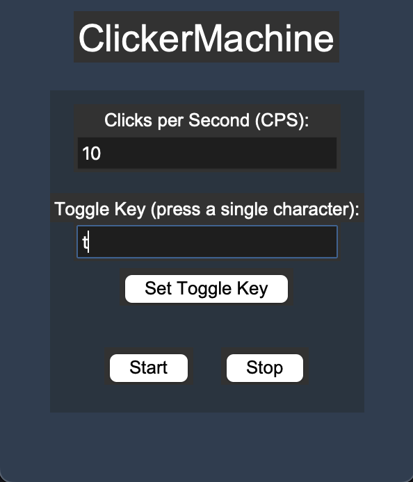

# ClickerMachine

**ClickerMachine** is a simple and customizable **autoclicker** built in Python using **Tkinter** for the GUI and **pynput** for mouse and keyboard control. It allows users to simulate mouse clicks at a configurable speed (CPS – Clicks Per Second) and toggle the autoclicking functionality with a customizable hotkey.

---

## Features

- **Customizable CPS**: Set how fast the autoclicker clicks, with input validation (1–100 CPS).
- **Start/Stop buttons**: Control the autoclicker directly from the GUI.
- **Hotkey toggle**: Press a specific key to start or stop clicking without interacting with the GUI.
- **Custom toggle key**: Change the hotkey for toggling clicks using the GUI.
- **Threaded operation**: Clicking runs in a separate thread, keeping the GUI responsive.
- **Simple, clean GUI** built with Tkinter.

---

## Installation

1. **Clone the repository** or download the script.
2. Install dependencies (if not already installed):

```bash
pip install pynput
```

3. Run the script:

```bash
python clicker_machine.py
```

---

## Usage

1. Open the GUI.
2. Set the desired **Clicks Per Second (CPS)** in the input field (1–100).
3. Set a **toggle key** if you want to use the keyboard to start/stop the autoclicker.
4. Click **Start** to begin clicking, or press the toggle key.
5. Click **Stop** to stop clicking.

---

### Hotkey Instructions

- By default, the toggle key is `t`.
- To change the toggle key:

  1. Enter a single character in the **Toggle Key** field.
  2. Click **Set Toggle Key**.
  3. Now pressing the new key will start/stop clicking.

---

## Notes

- The autoclicker will simulate **left mouse button clicks** only.
- The program runs in **threads**, so GUI interaction remains smooth.
- Ensure the CPS is a **positive number between 1 and 100**. Values outside this range will trigger an error.

---

## Dependencies

- [Python 3](https://www.python.org/)
- [Tkinter](https://docs.python.org/3/library/tkinter.html) (usually included with Python)
- [pynput](https://pypi.org/project/pynput/)

Install `pynput` with:

```bash
pip install pynput
```

---

## Screenshots



---

## License

MIT License – free to use, modify, and distribute.
